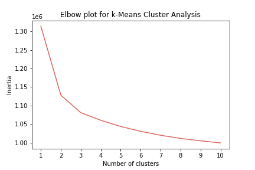
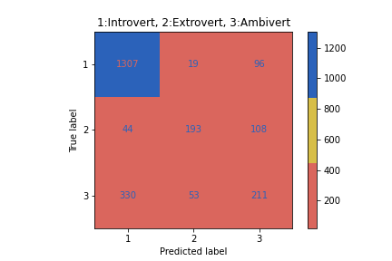

# **"Trait Predictor Project" _by Nomads_**

## **Founders:** Henry Tirado, Scott Seely, Sushma Kesamsetty
---

## **Objective**:
---

Our Project objective was to develop the machine learning application that would predict the personality trait of a person as Introvert/Extrovert/Ambivert based on 91 personality questions. Our ML algorithm is trained based on survey with the same set of personality questions. 

**_Introvert_**:  Introverts may prefer taking part in less stimulating activities and get pleasure from activities such as reading, writing or meditating.  Introverts typically prefer to concentrate on a single activity, analyze situations carefully and take time to think more before they speak.

**_Extrovert_**:  Extroverts usually prefer to seek out as much social interaction as possible because this is how they feel more energized. According to estimates, extroverts outnumber introverts by about three to one (Cain, 2012).

**_Ambivert_**:  Introversion/extroversion isn't an all-or-nothing trait; it's actually a continuum and some people might be very extroverted while others are less so.
An ambivert is a person who shows characteristics of both extroversion and introversion. In other words, they fall somewhere in the middle of the scale. People who are ambiverts are said to be moderately comfortable in social situations but also enjoy some solitary time.

---
## **Use Cases**:
---
Personality data has many commercial uses.
- Company hiring
- Dating sites
- Entertainment
- Career counseling

---
## **Configuration Requirements**:
---

Application expects DB configuration to fetch the survey data.

    Create a file "config.py" in the folder "code". Add and fill Username, Password, Host and Port in the file.
      driver='postgresql'
      username=
      password=
      host= 
      port= 
      database="postgres" 

---        
## **Library Requirements**:
---

- AWS RDS
- Postgresql
- Python
- Pandas
- HTML/CSS
- JavaScript
- D3
- Flask
- Matplotlib
- Tableau
- Scikit Learn
- Heroku
- Jupyter Notebook

---
## **Data Source**: 
---
- https://www.kaggle.com/yamqwe/introversionextraversion-scales

The questionaire contains 91 questions. The questions were presented one at a time in a random order. For each questions 3 values were recorded:

A - The user's selected response. 1=Disagree, 2=Slightly disagree, 3=Neutral, 4=Slightly agree, 5=Agree
I - The position of the question in the survey.
E - The time elapsed on that question in milliseconds.

---
## **Visualization**:
---

Tableau

---
## **Application Design**:
---
(https://ie-predictor.herokuapp.com/)
---
### **Machine Learning**:
---

To predict the personality trait of a person, we have trained our model using the data from 91 Questions survey taken by more than 7000 users (Data source: Kaggle).

First and foremost, to validate the dataset, we applied Unsupervised ML Algorithm - K-Means clustering to our Preprocessed data. The elbow curve plotted out of this cleansed data showed us there would 3 Clusters in the dataset. Proves that we were looking for the classes 1:Introvert, 2:Extrovert and 3:Ambivert.

To train our Machine learning model, We started with Random Forest classifier to make the predictions. Even after trying various hyperparameters, accuracy of our predictions remained to be around 72%.

The diagonal values of the confusion matrix show True predictions, attributed as True Introverts (Predicted#1307 Vs Actual#1422), True Extroverts (Predicted#193 Vs Actual#345) and True Ambiverts (Predicted#211 Vs Actual#594). Remaining numbers in the matrix show False predictions (False Introverts, False Extroverts, False Ambiverts).

As part of Accuracy improvement efforts, we trained our Machine Learning model using some other algorithms.

_Logistic Regression_: Had better accuracy both with Raw data and Standard scaled data.

_Linear Regression_: Performed very bad and this algorithm would not be considered for training by any means.

_Bagging & Boosting_: Using Bagging classifier, performed both Bagging (Hyper parameter: bootstrap=True) and Pasting (Hyper parameter: bootstrap=False). Bagging has the similar accuracy as Logistic Regression and Random Forest. Even with Bagging, accuracy was better with unscaled raw data. Tried AdaBoost, resulting in the similar accuracy score.

_Voting Classifier_: By definition of Voting classifier, it provides a way to create a better classifier by aggregating the predictions of each classifier and predict the class that gets the most votes. So I used Logistic Regression, Random Forest, Support Vector Machine, Bagging and Boosting classifier. Accuracy reached only upto 73% even with all the ML algorithms.

Hence we sticked on to using Random Forest Classifier for our application.

So, finally, the trained model is saved using Pickle.

In our web application, Once the user completes the Survey questionnaire, our already trained model would be unpickled to make the personality trait predictions. 

****

## **References**:

