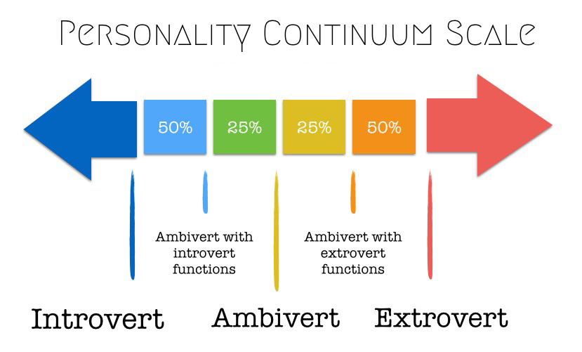
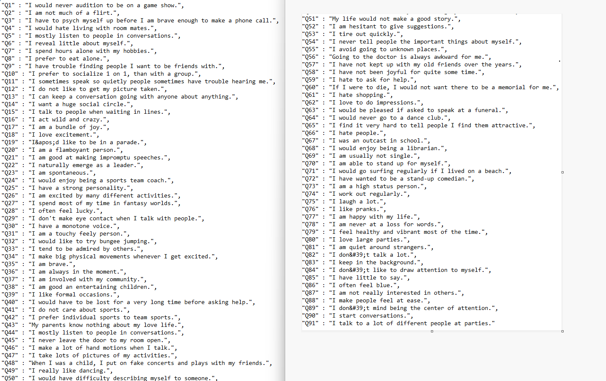

# **"Trait Predictor Project" _by Nomads_**

## **Founders:** Henry Tirado, Scott Seely, Sushma Kesamsetty
---

## **Objective**:
---

Our Project objective was to develop the machine learning application that would predict the personality trait of a person as Introvert/Extrovert/Ambivert based on 91 personality questions. Our ML algorithm is trained based on survey with the same set of personality questions. 

**_Introvert_**:  Introverts may prefer taking part in less stimulating activities and get pleasure from activities such as reading, writing or meditating.  Introverts typically prefer to concentrate on a single activity, analyze situations carefully and take time to think more before they speak.

**_Extrovert_**:  Extroverts usually prefer to seek out as much social interaction as possible because this is how they feel more energized. According to estimates, extroverts outnumber introverts by about three to one (Cain, 2012).

**_Ambivert_**:  Introversion/extroversion isn't an all-or-nothing trait; it's actually a continuum and some people might be very extroverted while others are less so.
An ambivert is a person who shows characteristics of both extroversion and introversion. In other words, they fall somewhere in the middle of the scale. People who are ambiverts are said to be moderately comfortable in social situations but also enjoy some solitary time.

---
## **Use Cases**:
---
Personality data has many commercial uses.
- Company hiring
- Dating sites
- Entertainment
- Career counseling

---
## **Configuration Requirements**:
---

Application expects DB configuration to fetch the survey data.

    Create a file "config.py" in the folder "code". Add and fill Username, Password, Host and Port in the file.
      driver='postgresql'
      username=
      password=
      host= 
      port= 
      database="postgres" 

---        
## **Library Requirements**:
---

- AWS RDS
- Postgresql
- Python
- Pandas
- HTML/CSS
- JavaScript
- D3
- Flask
- Matplotlib
- Tableau
- scikitlearn
- Heroku
- Jupyter

---
## **Data Source**: 
---
- https://www.kaggle.com/yamqwe/introversionextraversion-scales

---
## **Visualization**:
---

Tableau

---
## **Machine Learning Algorithm Performance**:
---

Our machine learning model uses Random Forest classifier to make the predictions based on user responses to the 91 personality questions. Personality of a person can be 1:Introvert, 2:Extrovert or 3:Ambivert. 

Accuracy of our predictions is approximately 72%.

